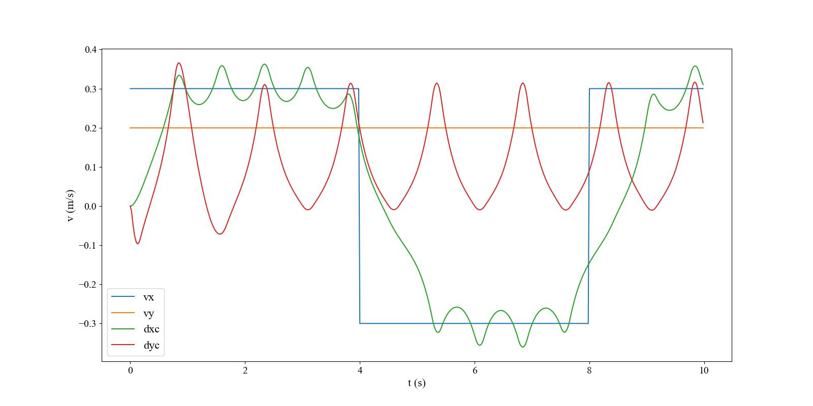
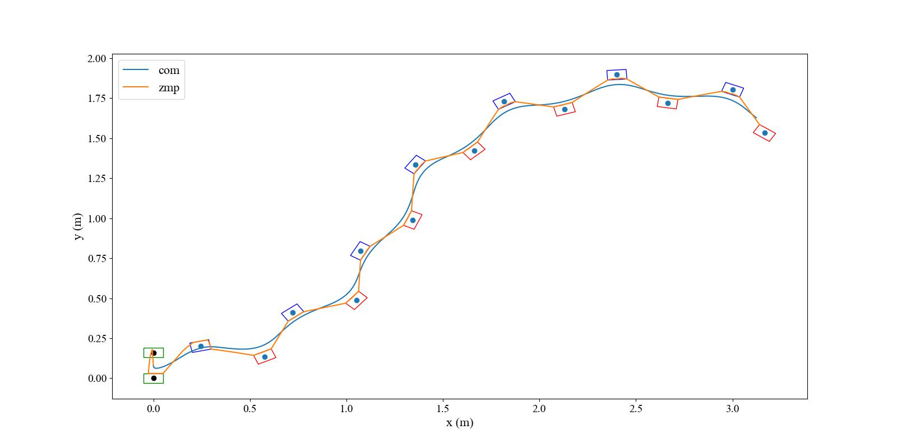

# MPC gait generation

This repository is an implementation in python code of the MPC gait generation described in the "[MPC for Humanoid Gait Generation: Stability and Feasibility](https://ieeexplore.ieee.org/abstract/document/8955951)"

## Requirements

matplotlib
​numpy
​scipy
​[qpsolvers](https://pypi.org/project/qpsolvers/)

## Control Framework

## QP problem
$$
\min_{\begin{array}{c}\dot{X}_z^k,\dot{Y}_z\\X_f,Y_f\end{array}}\|\dot{X}_z^k\|^2+\|\dot{Y}_z^k\|^2+\beta(\|X_f-\hat{X}_f\|^2+\|Y_f-\hat{Y}_f\|^2)
$$
**Constrains**:Kinematic Constrains,ZMP Position Constrains,Stability Constraint and ZMP Velocity Constraint
### Constrains

#### Kinematic Constrains

$$
\pm\binom0\ell-\frac12\binom{d_{a,x}}{d_{a,y}}\leq R_{j-1}^T\binom{\hat{x}_f^j-\hat{x}_f^{j-1}}{\hat{y}_f^j-\hat{y}_f^{j-1}}\leq\pm\binom0\ell+\frac12\binom{d_{a,x}}{d_{a,y}}
$$

#### ZMP Position Constrains
##### Single Support 
$$
-\frac12\binom{d_{z,x}}{d_{z,y}}\leq R_j^T\begin{pmatrix}\Delta t\sum_{l=0}^i\dot{x}_z^{k+l}-x_f^j\\\\\Delta t\sum_{l=0}^i\dot{y}_z^{k+l}-y_f^j\end{pmatrix}+R_j^T\begin{pmatrix}x_z^k\\y_z^k\end{pmatrix}\leq\frac12\binom{d_{z,x}}{d_{z,y}}
$$

##### Double Support(moving constrains)

$$
x_{mc}(t)=\left(1-\alpha^j(t)\right)x_f^j+\alpha^j(t)x_f^{j+1}
\\\
y_{mc}(t)=\left(1-\alpha^j(t)\right)y_f^j+\alpha^j(t)y_f^{j+1}
\\\
\theta_{mc}(t)=\left(1-\alpha^j(t)\right)x_f^j+\alpha^j(t)\theta_f^{j+1}
\\\
\alpha^j(t)=\frac{t-t_s^j}{T_{ds}^j},t\in[t_s^j,t_s^j+T_{ds}^j]
$$
and
$$
-\frac{1}{2}\binom{d_{z,x}}{d_{z,y}}\leq R_{mc}^T\begin{pmatrix}\Delta t\sum_{l=0}^i\dot{x}_z^{k+l}-x_{mc}^i\\\\\Delta t\sum_{l=0}^i\dot{y}_z^{k+l}-y_{mc}^i\end{pmatrix}+R_{mc}^T\begin{pmatrix}x_z^k\\y_z^k\end{pmatrix}\leq\frac{1}{2}\binom{d_{z,x}}{d_{z,y}}
$$
#### Stability Constraint
$$
\sum_{i=0}^{C-1}e^{-i\eta\delta}\dot{x}_z^{k+i}=-\sum_{i=C}^\infty e^{-i\eta\delta}\dot{x}_z^{k+i}+\frac\eta{1-e^{-\eta\delta}}(x_u^k-x_z^k)
$$
#### ZMP Velocity Constraint
$$
|\dot{x}_z|\leq v^{max},|\dot{y}_z|\leq v^{max}
$$

## Results
### simulation 1

### simulation 2

### simulation 3

